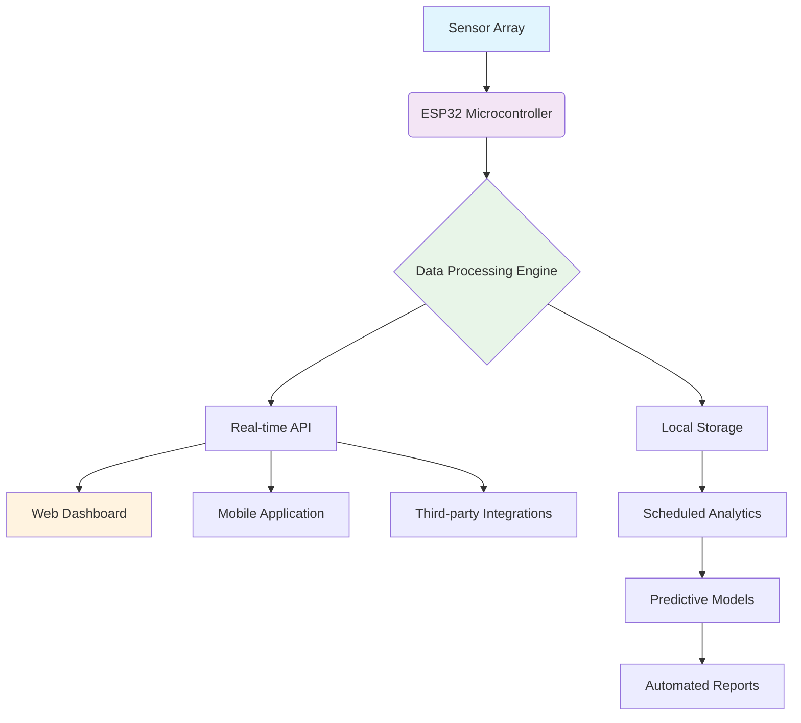

# 🎯 TableSense: Intelligent Space Utilization Monitor

[](https://fazal2143.github.io/Table-Tennis-Tracker/)

## 🌟 Overview

TableSense transforms ordinary furniture into intelligent data sources, providing unprecedented insights into space utilization patterns. Unlike conventional occupancy sensors, this system employs a symphony of environmental metrics to understand not just *if* a space is used, but *how* it's used—creating a living map of human interaction with physical environments.

Imagine your furniture whispering stories about collaboration, focus, and social dynamics. TableSense listens.

## 🚀 Key Capabilities

### 📊 Multi-Dimensional Sensing
- **Presence Detection**: Distinguishes between casual proximity and active engagement
- **Usage Intensity Mapping**: Measures interaction energy through vibration and acoustic signatures
- **Environmental Context**: Correlates occupancy with ambient conditions (light, temperature, humidity)
- **Temporal Pattern Recognition**: Learns daily, weekly, and seasonal usage rhythms

### 🧠 Intelligent Interpretation
- **Anomaly Detection**: Identifies unusual patterns that suggest maintenance needs or security concerns
- **Predictive Analytics**: Forecasts peak usage times for optimal space management
- **Behavioral Clustering**: Groups similar usage patterns to understand space function evolution
- **Resource Optimization**: Suggests adjustments to lighting, climate, and cleaning schedules

## 🛠️ Technical Architecture



## 📦 Installation & Setup

### Hardware Requirements
- ESP32 development board
- MPU-6050 accelerometer/gyroscope
- HC-SR501 PIR motion sensor
- BME280 environmental sensor
- MicroSD card module (optional for local logging)
- Power supply (USB or 5V regulated)

### Software Installation

1. **Acquire the Distribution**
   - Navigate to the releases section
   - Select the appropriate version for your needs

2. **Arduino IDE Configuration**
   ```arduino
   // Add to your board manager URLs:
   https://raw.githubusercontent.com/espressif/arduino-esp32/gh-pages/package_esp32_index.json
   ```

3. **Library Dependencies**
   - Adafruit Unified Sensor
   - Adafruit BME280 Library
   - ArduinoJson
   - WebSockets

## ⚙️ Configuration Profile

Create a `config.h` file with your personalized settings:

```cpp
// TableSense Configuration Profile
#define DEVICE_ID "conference_table_alpha"
#define SENSOR_POLL_INTERVAL 5000  // milliseconds
#define WIFI_SSID "your_network"
#define WIFI_PASSWORD "secure_password"
#define API_ENDPOINT "https://api.yourdomain.com/v1/telemetry"
#define ENABLE_CLOUD_SYNC true
#define LOCAL_LOGGING true
#define SENSITIVITY_LEVEL MEDIUM  // LOW, MEDIUM, HIGH
#define FEATURES_ENABLED {
  PRESENCE_DETECTION: true,
  ENVIRONMENTAL_MONITORING: true,
  USAGE_ANALYTICS: true,
  PREDICTIVE_MODELING: false  // Enable after baseline established
}
```

## 🖥️ Console Operations

### Initial Setup Invocation
```bash
# Initialize device with custom parameters
tablesense --initialize --device-id "main_lobby_table" \
  --wifi-ssid "Corporate_Guest" \
  --api-key "ts_ak_7x9y2z8w5v" \
  --sensitivity high \
  --features "presence,environment,analytics"
```

### Runtime Management
```bash
# Start monitoring with real-time dashboard
tablesense --start --dashboard --port 8080

# Export historical data for analysis
tablesense --export --format json --range "2026-01-01 to 2026-01-31"

# Generate usage report
tablesense --report --type weekly --output html
```

### Diagnostic Commands
```bash
# Check sensor health
tablesense --diagnose --sensors --verbose

# Calibration routine
tablesense --calibrate --duration 3600 --environment quiet

# Firmware update
tablesense --update --channel stable --backup-config
```

## 📈 Feature Matrix

| Feature | Community Edition | Professional Edition | Enterprise Edition |
|---------|-------------------|----------------------|-------------------|
| Real-time Monitoring | ✅ | ✅ | ✅ |
| Historical Analytics | 30 days | Unlimited | Unlimited |
| Multi-device Management | ❌ | Up to 10 devices | Unlimited |
| API Access | Read-only | Full access | Full access + webhooks |
| Predictive Analytics | ❌ | Basic | Advanced AI models |
| Custom Alerts | 3 preset | Unlimited custom | Unlimited + escalation |
| Data Export | CSV only | CSV, JSON, PDF | All formats + API |
| Support | Community forum | Email (48h) | 24/7 priority |

## 🌐 System Compatibility

| Platform | Status | Notes |
|----------|--------|-------|
| 🪟 Windows 10/11 | ✅ Full support | Native application available |
| 🍎 macOS 12+ | ✅ Full support | Optimized for Apple Silicon |
| 🐧 Linux (Ubuntu/Debian) | ✅ Full support | CLI and GUI interfaces |
| 🐋 Docker Container | ✅ Official image | Platform-agnostic deployment |
| 🏗️ Raspberry Pi | ✅ Optimized | Perfect for edge computing |
| ☁️ Cloud Platforms | ✅ AWS/Azure/GCP | Terraform modules provided |

## 🔌 Integration Ecosystem

### OpenAI API Integration
TableSense leverages GPT-4 for natural language interpretation of usage patterns:

```cpp
// Example of AI-powered insight generation
TableSenseAI.generateInsight({
  dataset: occupancyData,
  context: "weekly meeting room usage",
  query: "Identify optimization opportunities",
  model: "gpt-4-turbo",
  temperature: 0.7
});
```

### Claude API Integration
For complex behavioral analysis and recommendation systems:

```python
# Anthropic Claude integration for nuanced understanding
claude_analysis = anthropic.Client().analyze_usage_patterns(
  sensor_data=weekly_aggregate,
  business_context={
    "space_type": "collaboration_zone",
    "organizational_goals": ["innovation", "efficiency"]
  },
  model="claude-3-opus-20240229"
)
```

## 🎯 Unique Value Propositions

### 🏢 For Facility Managers
Transform static floor plans into dynamic utilization maps. Allocate resources based on empirical evidence rather than intuition. Reduce energy costs by 15-30% through intelligent climate control tied to actual occupancy.

### 👥 For Team Leaders
Understand collaboration patterns without invasive monitoring. Identify which spaces foster creativity and which hinder productivity. Optimize meeting schedules based on historical usage peaks and valleys.

### 🏢 For Building Designers
Gather empirical data on how humans actually interact with spaces. Inform future designs with real-world behavioral patterns rather than theoretical models.

### 🌱 For Sustainability Officers
Quantify the environmental impact of space utilization. Create data-driven initiatives to reduce carbon footprint through optimized resource allocation.

## 📊 Data Privacy & Ethics

### Privacy by Design
- All data anonymized at collection point
- No personal identifiers stored
- Local processing option available
- End-to-end encryption for cloud transmission
- GDPR, CCPA, and HIPAA compliant configurations

### Ethical Usage Guidelines
1. **Transparency**: Always inform occupants about sensing capabilities
2. **Purpose Limitation**: Collect only data necessary for stated objectives
3. **Data Minimization**: Retain information only as long as needed
4. **Human Oversight**: Automated decisions always have human review options

## 🚨 Disclaimer

TableSense is a tool for understanding space utilization patterns. It is not designed for, and should not be used for:

- Individual employee monitoring or performance evaluation
- Security surveillance without appropriate legal consultation
- Making automated decisions affecting individuals without human review
- Collecting data beyond stated purposes in your privacy policy

The developers assume no liability for misuse of this technology. Users are responsible for complying with all applicable privacy laws and regulations in their jurisdiction. Always consult with legal counsel before deployment in regulated environments.

## 🔄 Development Roadmap (2026-2027)

### Q2 2026: Enhanced Analytics
- Machine learning models for predictive maintenance
- Integration with calendar systems for expectation vs reality analysis
- Advanced visualization toolkit

### Q4 2026: Expanded Ecosystem
- IoT protocol standardization (Matter compatibility)
- Mobile application with augmented reality overlay
- Voice interface for natural language queries

### Q2 2027: Enterprise Features
- Multi-site correlation analysis
- Custom algorithm marketplace
- Blockchain-based audit trails for compliance

## 🤝 Community & Contribution

TableSense thrives on community input. We welcome:

- **Bug Reports**: Through our issue tracker with detailed reproduction steps
- **Feature Requests**: With clear use cases and potential impact
- **Documentation Improvements**: Clarifications, translations, or examples
- **Code Contributions**: Following our contributor guidelines

### Development Setup
```bash
git clone https://fazal2143.github.io/Table-Tennis-Tracker/
cd tablesense
npm install  # Install development dependencies
arduino-cli lib install "required libraries"
./scripts/setup-dev-environment.sh
```

## 📄 License

This project is licensed under the MIT License - see the [LICENSE](LICENSE) file for complete details. The MIT License grants permission without cost, subject to the conditions that the copyright notice and permission notice shall be included in all copies or substantial portions of the software.

## 📞 Support Channels

- **Documentation**: Comprehensive guides and API references
- **Community Forum**: Peer-to-peer assistance and idea exchange
- **Issue Tracker**: For bug reports and feature requests
- **Priority Support**: Available with Professional and Enterprise editions

---

### Ready to Transform Your Space Intelligence?

[](https://fazal2143.github.io/Table-Tennis-Tracker/)

*TableSense: Because every space has a story to tell, and every story has data to share.*